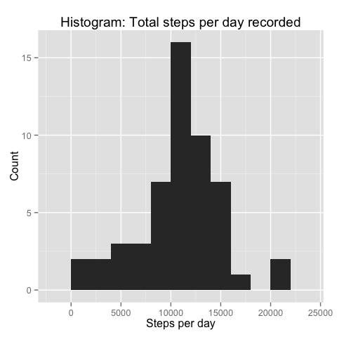
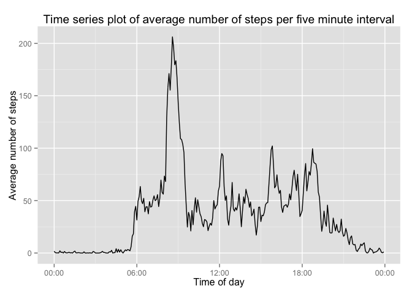
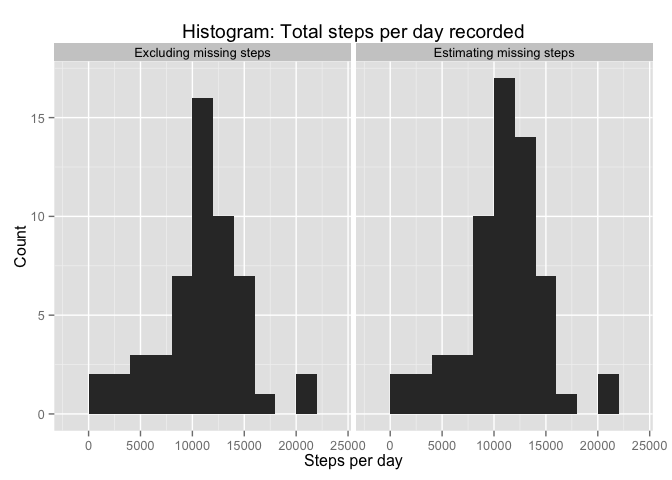
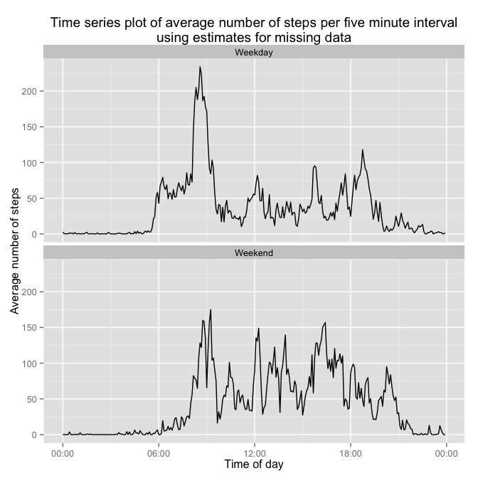

# Reproducible Research: Peer Assessment 1
ageyl  


## Loading and preprocessing the data

### Loading the data
After forking the github repository and setting the working directory to the "RepData_PeerAssessment1" folder, the activity data is unzipped and loaded into a data.table using "fread" rather than "read.csv":


```r
setwd("/Users/andy/Coursera/DataScience/Reproducible_Research/RepData_PeerAssessment1")
unzip("activity.zip", files = "activity.csv")
library(data.table)
activity_dt <- fread("activity.csv")
```

### Preprocessing the data
* Convert "date" to a date object
* Convert "interval" to a "time of day" (to enable cleaner and more accurate plots)
* Get the day of the week from the date  
* Create a variable to indicate whether a day occurs during the working week or on the weekend


```r
# Convert “date” to a date object
activity_dt$date <- as.Date(activity_dt$date)
```


```r
# Convert "interval" to a "time of day" (to enable cleaner and more accurate plots)
library(lubridate)
interval_vec <- formatC(activity_dt[, interval], width=4, flag=0)
timeOfDay_vec <- paste(substr(interval_vec, 1, 2), substr(interval_vec, 3, 4), sep=":")
activity_dt[, seconds := as.numeric(as.Date(hm(timeOfDay_vec), origin=as.Date("1970-01-01")))]
activity_dt[, timeOfDay := ISOdatetime(1970,1,1,0,0,0,tz="UTC") + seconds]
```


```r
# Get the day of the week from the date 
activity_dt[, dayOfWeek := weekdays(date)]
```


```r
# Create a variable to indicate whether a day occurs during the working week or on the weekend
activity_dt[, weekend := "Weekday"]
activity_dt[dayOfWeek %in% c("Saturday", "Sunday"), weekend := "Weekend"]
```
  
***
## What is mean total number of steps taken per day?
### Calculate total steps per day
A new data.table summarises total steps per day from the *activity_dt* data.table:

```r
daily_activity_dt <- activity_dt[!is.na(steps), list(daily_steps=sum(steps)), by = date]
head(daily_activity_dt)
```

```
##          date daily_steps
## 1: 2012-10-02         126
## 2: 2012-10-03       11352
## 3: 2012-10-04       12116
## 4: 2012-10-05       13294
## 5: 2012-10-06       15420
## 6: 2012-10-07       11015
```

### Histogram of the total number of steps taken per day

```r
library(ggplot2)
ggplot(daily_activity_dt, aes(x = daily_steps)) + stat_bin(binwidth=2000) +
                xlab("Steps per day") + ylab("Count") +
                ggtitle("Histogram: Total steps per day recorded")
```

 
  
### Mean and median of the total number of steps taken per day

```r
library(dplyr)
meanDailySteps <-  mean(daily_activity_dt[, daily_steps]) %>% formatC(format="f", digits=2) 
medianDailySteps <-  median(daily_activity_dt[, daily_steps])
```
  
 
 
**Mean daily steps: 10766.19 **  
**Median daily steps: 10765**  

***

## What is the average daily activity pattern?
### Time series plot
The step data can be averaged by "interval" however the "time of day" alias results in a much clearer time series plot, and is used here instead.  


```r
library(scales)
interval_activity_dt <- activity_dt[!is.na(steps), list(interval=interval[1], mean_interval_steps=mean(steps)), by = timeOfDay]

ggplot(interval_activity_dt, aes(x=timeOfDay, mean_interval_steps)) + geom_line() +
                        ylab("Average number of steps") +  
                        scale_x_datetime(labels=date_format("%H:%M")) +
                        xlab("Time of day") +
                        ggtitle("Time series plot of average number of steps per five minute interval")
```

 
  
  
### Which 5 minute interval contains the maximum average number of steps?


```r
max_step_interval <- interval_activity_dt[which.max(mean_interval_steps), interval]
max_step_interval
```

```
## [1] 835
```

```r
max_step_timeOfDay <- format(interval_activity_dt[which.max(mean_interval_steps), timeOfDay], "%l:%M %p")
max_step_timeOfDay
```

```
## [1] " 8:35 am"
```

The interval at which the maximum average number of steps occurs is **interval 835**


In terms of clock time, this is **the five minutes up to  8:35 am**  

***  


## Imputing missing values
### The total number of missing values in the dataset

```r
totalMissingValues <- nrow(activity_dt[is.na(steps)])
totalMissingValues
```

```
## [1] 2304
```

The total number of missing values is 2304 five-minute intervals. 

### A strategy for filling in all of the missing values in the dataset
The distribution of the missing values is of interest:


```r
activity_dt[is.na(steps), 
            list(dayOfWeek=dayOfWeek[1], weekend=weekend[1], missing = .N), by=date]
```

```
##          date dayOfWeek weekend missing
## 1: 2012-10-01    Monday Weekday     288
## 2: 2012-10-08    Monday Weekday     288
## 3: 2012-11-01  Thursday Weekday     288
## 4: 2012-11-04    Sunday Weekend     288
## 5: 2012-11-09    Friday Weekday     288
## 6: 2012-11-10  Saturday Weekend     288
## 7: 2012-11-14 Wednesday Weekday     288
## 8: 2012-11-30    Friday Weekday     288
```

This shows that the missing data consists of eight entire 24 hour periods, distributed fairly evenly over the days of the week. A suggested strategy to impute the missing values is to average the number of steps by both time of day and day of week.

### A new dataset with missing values filled in


```r
estSteps_dt <- activity_dt[, list(date,  weekend, dayOfWeek, timeOfDay, interval, steps)]
estSteps_dt[, meanSteps := as.numeric(mean(steps, na.rm=T)), by=list(interval, dayOfWeek)]
estSteps_dt[, imputedSteps := as.numeric(steps)]
estSteps_dt[is.na(imputedSteps), imputedSteps := meanSteps]
```

### Histogram of steps per day, comparing averages excluding and estimating missing data

```r
library(reshape2)
daily_activity_dt2<- data.table(melt(estSteps_dt[, 
                        list("Excluding missing steps" = sum(steps), 
                                "Estimating missing steps" = sum(imputedSteps)), 
                        by=date], "date"))
                          
ggplot(daily_activity_dt2, aes(value)) + stat_bin(binwidth=2000) +
                facet_wrap(~variable, nrow=1) +
                xlab("Steps per day") + ylab("Count") +
                ggtitle("Histogram: Total steps per day recorded")
```

 
  

### Mean and median steps per day

```r
daily_activity_dt2[, 
        list(mean=mean(na.omit(value)), median=median(na.omit(value))), by=variable]
```

```
##                    variable     mean median
## 1:  Excluding missing steps 10766.19  10765
## 2: Estimating missing steps 10821.21  11015
```
When daily step averages and medians are calculated from data that includes an estimation of the missing values and data that does not, the results are not very different -- slightly higher in both cases. Further, the distributions of the daily averages, as shown in histograms above, are also similar. Since the missing data was evenly distributed across intervals, and not too unevenly distributed across day of the week, this is not an unexpected result.  

***

## Are there differences in activity patterns between weekdays and weekends?

Weekend and weekday averages are calculated using the "estSteps_dt" data.table, which uses the imputed missign values:


```r
interval_activity_dt2 <- estSteps_dt[!is.na(steps), 
                list(mean_interval_steps=mean(steps)), by = list(weekend, timeOfDay)]

ggplot(interval_activity_dt2, aes(x=timeOfDay, mean_interval_steps)) + geom_line() +
                facet_wrap(~weekend, ncol=1) +
                ylab("Average number of steps") +  
                scale_x_datetime(labels=date_format("%H:%M")) +
                xlab("Time of day") +
                ggtitle("Time series plot of average number of steps per five minute interval\nusing estimates for missing data")
```

 


The differences between weekend and weekday step patterns are clear --  

* 6am is the average start time of a weekday, but weekend start times begin at 6am and peak at 9am  

* The average number of steps per interval on a weekday plateus from 6am until 8am, after which there is another spike in activity,  probably travelling to work. This early morning plateau does not occur on the weekend.  

* Between the hours of 9am and 6pm on a weekend day, activity is fairly consistent. During the working week there are periods sudden activity and quiescence -- activity spikes near 8:30am, midday, 3:30pm and 6:30pm -- which may tell us something about the subjects commuting and lunch time habits.


